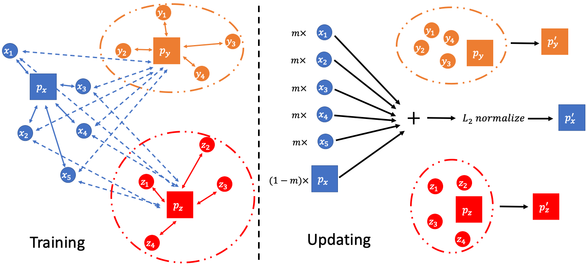
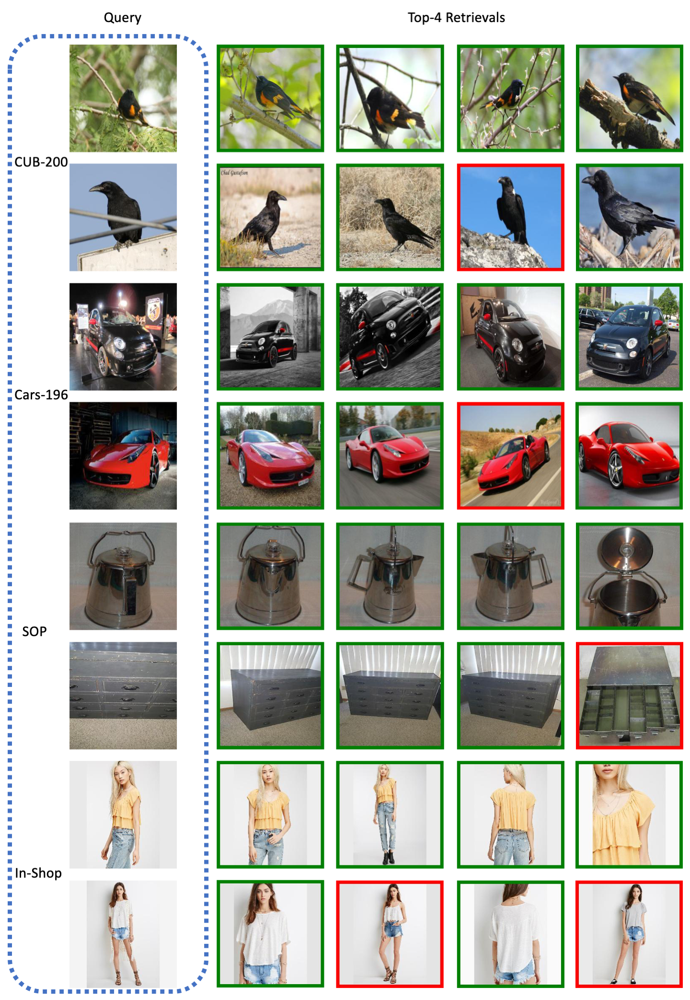

# AsymptoticProxy
A PyTorch implementation of Asymptotic Proxy based on the paper [Asymptotic proxy for deep metric learning]().



## Requirements
- [Anaconda](https://www.anaconda.com/download/)
- [PyTorch](https://pytorch.org)
```
conda install pytorch torchvision cudatoolkit=10.0 -c pytorch
```
- pretrainedmodels
```
pip install pretrainedmodels
```
- SciencePlots
```
pip install SciencePlots
```

## Datasets
[CARS196](http://ai.stanford.edu/~jkrause/cars/car_dataset.html), [CUB200-2011](http://www.vision.caltech.edu/visipedia/CUB-200-2011.html), 
[Standard Online Products](http://cvgl.stanford.edu/projects/lifted_struct/) and 
[In-shop Clothes](http://mmlab.ie.cuhk.edu.hk/projects/DeepFashion/InShopRetrieval.html) are used in this repo.

You should download these datasets by yourself, and extract them into `${data_path}` directory, make sure the dir names are 
`car`, `cub`, `sop` and `isc`. Then run `data_utils.py` to preprocess them.

## Usage
### Train Model
```
python train.py --feature_dim 1024
optional arguments:
--data_path                   datasets path [default value is '/home/data']
--data_name                   dataset name [default value is 'car'](choices=['car', 'cub', 'sop', 'isc'])
--backbone_type               backbone network type [default value is 'resnet50'](choices=['resnet50', 'inception', 'googlenet'])
--feature_dim                 feature dim [default value is 512]
--temperature                 temperature scale used in temperature softmax [default value is 0.03]
--momentum                    momentum used for the update of moving proxies [default value is 0.5]
--recalls                     selected recall [default value is '1,2,4,8']
--batch_size                  training batch size [default value is 128]
--lr                          learning rate [default value is 1e-4]
--num_epochs                  training epoch number [default value is 30]
```

### Test Model
```
python test.py --retrieval_num 10
optional arguments:
--query_img_name              query image name [default value is '/home/data/car/uncropped/008055.jpg']
--data_base                   queried database [default value is 'car_resnet50_512_0.03_0.5_data_base.pth']
--retrieval_num               retrieval number [default value is 8]
```

### Toy Example
```
python toy.py --with_learnable_proxy
optional arguments:
--data_path                   dataset path [default value is '/home/data/stl10']
--temperature                 temperature scale used in temperature softmax [default value is 0.03]
--with_learnable_proxy        use learnable proxy or not [default value is False]
--momentum                    momentum used for the update of moving proxies [default value is 0.5]
--batch_size                  training batch size [default value is 128]
--num_epochs                  training epoch number [default value is 30]
```

## Benchmarks
The models are trained on one NVIDIA Tesla V100 (32G) GPU. `temperature` is `0.03` for `CARS196` and `CUB200` datasets, 
`0.05` for `SOP` and `In-shop` datasets. `lr` is `1e-4` for `CARS196` and `CUB200` datasets, `4e-5` for `SOP` and `In-shop` datasets, 
`momentum` is `0.5` for `CARS196` and `CUB200` datasets, `0.95` for `SOP` and `In-shop` datasets, other hyper-parameters 
are the default values.

### CARS196 (Dense | Binary)
<table>
  <thead>
    <tr>
      <th>Backbone</th>
      <th>R@1</th>
      <th>R@2</th>
      <th>R@4</th>
      <th>R@8</th>
      <th>Download</th>
    </tr>
  </thead>
  <tbody>
    <tr>
      <td align="center">ResNet50</td>
      <td align="center">87.0% | 79.5%</td>
      <td align="center">92.5% | 87.7%</td>
      <td align="center">95.6% | 92.5%</td>
      <td align="center">97.4% | 95.7%</td>
      <td align="center"><a href="https://pan.baidu.com/s/1buUyFR5bShLcvVkmnB5kEA">4ahv</a></td>
    </tr>
    <tr>
      <td align="center">Inception</td>
      <td align="center">84.0% | 77.0%</td>
      <td align="center">90.5% | 85.5%</td>
      <td align="center">94.3% | 91.0%</td>
      <td align="center">96.6% | 94.8%</td>
      <td align="center"><a href="https://pan.baidu.com/s/1CBuOIOXmf_L8kUbIIhuLhw">w66g</a></td>
    </tr>
    <tr>
      <td align="center">GoogLeNet</td>
      <td align="center">78.8% | 70.8%</td>
      <td align="center">86.2% | 81.2%</td>
      <td align="center">91.5% | 88.0%</td>
      <td align="center">95.1% | 93.1%</td>
      <td align="center"><a href="https://pan.baidu.com/s/1O2l49xOKiAmCP3kPq81npA">i3tz</a></td>
    </tr>
  </tbody>
</table>

### CUB200 (Dense | Binary)
<table>
  <thead>
    <tr>
      <th>Backbone</th>
      <th>R@1</th>
      <th>R@2</th>
      <th>R@4</th>
      <th>R@8</th>
      <th>Download</th>
    </tr>
  </thead>
  <tbody>
    <tr>
      <td align="center">ResNet50</td>
      <td align="center">70.0% | 61.6%</td>
      <td align="center">79.6% | 74.0%</td>
      <td align="center">86.9% | 82.9%</td>
      <td align="center">92.2% | 89.6%</td>
      <td align="center"><a href="https://pan.baidu.com/s/11xIyDFbUdjpgMJbXVsZbPw">ek5w</a></td>
    </tr>
    <tr>
      <td align="center">Inception</td>
      <td align="center">66.7% | 58.4%</td>
      <td align="center">77.3% | 70.2%</td>
      <td align="center">85.7% | 81.5%</td>
      <td align="center">91.0% | 88.8%</td>
      <td align="center"><a href="https://pan.baidu.com/s/1Qo9Ax-9HDrkMn0wewvIUOw">48qr</a></td>
    </tr>
    <tr>
      <td align="center">GoogLeNet</td>
      <td align="center">62.5% | 55.8%</td>
      <td align="center">73.6% | 68.6%</td>
      <td align="center">82.8% | 79.4%</td>
      <td align="center">89.8% | 87.3%</td>
      <td align="center"><a href="https://pan.baidu.com/s/1N4e9VcF72T4TQqmciPqWGw">s4uv</a></td>
    </tr>
  </tbody>
</table>

### SOP (Dense | Binary)
<table>
  <thead>
    <tr>
      <th>Backbone</th>
      <th>R@1</th>
      <th>R@10</th>
      <th>R@100</th>
      <th>R@1000</th>
      <th>Download</th>
    </tr>
  </thead>
  <tbody>
    <tr>
      <td align="center">ResNet50</td>
      <td align="center">80.3% | 76.9%</td>
      <td align="center">91.2% | 89.7%</td>
      <td align="center">96.3% | 95.6%</td>
      <td align="center">98.8% | 98.5%</td>
      <td align="center"><a href="https://pan.baidu.com/s/15sLH2zToW4TukhgHFWYaZA">vfmh</a></td>
    </tr>
    <tr>
      <td align="center">Inception</td>
      <td align="center">78.5% | 74.9%</td>
      <td align="center">90.3% | 88.3%</td>
      <td align="center">95.8% | 95.0%</td>
      <td align="center">98.7% | 98.4%</td>
      <td align="center"><a href="https://pan.baidu.com/s/1BrLjeejWDSvt5KJvmJMD0w">gdea</a></td>
    </tr>
    <tr>
      <td align="center">GoogLeNet</td>
      <td align="center">72.6% | 68.8%</td>
      <td align="center">86.4% | 84.3%</td>
      <td align="center">94.1% | 93.2%</td>
      <td align="center">98.1% | 97.8%</td>
      <td align="center"><a href="https://pan.baidu.com/s/16p7PTSZcDbu3ucziEsHBJA">3swt</a></td>
    </tr>
  </tbody>
</table>

### In-shop (Dense | Binary)
<table>
  <thead>
    <tr>
      <th>Backbone</th>
      <th>R@1</th>
      <th>R@10</th>
      <th>R@20</th>
      <th>R@30</th>
      <th>R@40</th>
      <th>R@50</th>
      <th>Download</th>
    </tr>
  </thead>
  <tbody>
    <tr>
      <td align="center">ResNet50</td>
      <td align="center">90.2% | 87.3%</td>
      <td align="center">98.1% | 97.4%</td>
      <td align="center">98.6% | 98.3%</td>
      <td align="center">99.0% | 98.7%</td>
      <td align="center">99.1% | 98.9%</td>
      <td align="center">99.3% | 99.1%</td>
      <td align="center"><a href="https://pan.baidu.com/s/1FhmQt5H0_UXjKzLrJSLYVw">fvst</a></td>
    </tr>
    <tr>
      <td align="center">Inception</td>
      <td align="center">87.7% | 84.6%</td>
      <td align="center">97.5% | 96.6%</td>
      <td align="center">98.3% | 97.9%</td>
      <td align="center">98.6% | 98.3%</td>
      <td align="center">98.8% | 98.6%</td>
      <td align="center">98.9% | 98.8%</td>
      <td align="center"><a href="https://pan.baidu.com/s/1GwbDVKxKY79Kce0mPwqwzA">f2xv</a></td>
    </tr>
    <tr>
      <td align="center">GoogLeNet</td>
      <td align="center">78.6% | 74.4%</td>
      <td align="center">94.2% | 93.0%</td>
      <td align="center">96.3% | 95.5%</td>
      <td align="center">97.1% | 96.6%</td>
      <td align="center">97.7% | 97.1%</td>
      <td align="center">97.9% | 97.4%</td>
      <td align="center"><a href="https://pan.baidu.com/s/1kup9Ksu_qC00-x9gTuFx7A">7ax5</a></td>
    </tr>
  </tbody>
</table>

## Results
