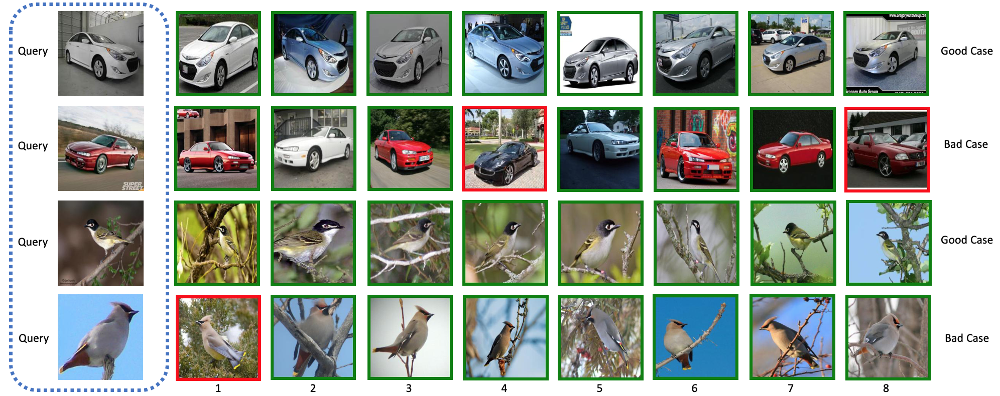

# BalancedProxy

A PyTorch implementation of Balanced Proxy Loss based on PRL
paper [Balanced proxy loss for fine-grained image retrieval]().

## Requirements

- [Anaconda](https://www.anaconda.com/download/)
- [PyTorch](https://pytorch.org)

```
conda install pytorch torchvision cudatoolkit=11.0 -c pytorch
```

- pretrainedmodels

```
pip install pretrainedmodels
```

## Datasets

[CARS196](http://ai.stanford.edu/~jkrause/cars/car_dataset.html)
and [CUB200-2011](http://www.vision.caltech.edu/visipedia/CUB-200-2011.html)
are used in this repo. You should download these datasets by yourself, and extract them into `${data_path}` directory,
make sure the dir names are `car` and `cub`. Then run `data_utils.py` to preprocess them.

## Usage

### Train Model

```
python train.py  --data_name cub --backbone_type inception --feature_dim 256
optional arguments:
--data_path                   datasets path [default value is '/home/data']
--data_name                   dataset name [default value is 'car'](choices=['car', 'cub'])
--backbone_type               backbone network type [default value is 'resnet50'](choices=['resnet50', 'inception', 'googlenet'])
--feature_dim                 feature dim [default value is 512]
--batch_size                  training batch size [default value is 64]
--num_epochs                  training epoch number [default value is 20]
--warm_up                     warm up number [default value is 2]
--recalls                     selected recall [default value is '1,2,4,8']
```

### Test Model

```
python test.py --retrieval_num 10
optional arguments:
--query_img_name              query image name [default value is '/home/data/car/uncropped/008055.jpg']
--data_base                   queried database [default value is 'car_resnet50_512_data_base.pth']
--retrieval_num               retrieval number [default value is 8]
```

## Benchmarks

The models are trained on one NVIDIA GeForce GTX 1070 (8G) GPU. `lr` is `1e-2`
for the parameters of `proxies` and `1e-4` for other parameters, every `5 steps` the `lr` is reduced by `2`.
`scale` is `32` and `margin` is `0.1`, `weight decay` is used, a `layer_norm` op is injected to centering the embedding,
other hyper-parameters are the default values.

### CARS196

<table>
  <thead>
    <tr>
      <th>Backbone</th>
      <th>R@1</th>
      <th>R@2</th>
      <th>R@4</th>
      <th>R@8</th>
      <th>Download</th>
    </tr>
  </thead>
  <tbody>
    <tr>
      <td align="center">ResNet50</td>
      <td align="center">88.3%</td>
      <td align="center">93.0%</td>
      <td align="center">95.9%</td>
      <td align="center">97.6%</td>
      <td align="center"><a href="https://pan.baidu.com/s/1cechFLcP_Tv5ozQ4Dm5ZcA">miyk</a></td>
    </tr>
    <tr>
      <td align="center">Inception</td>
      <td align="center">84.3%</td>
      <td align="center">91.0%</td>
      <td align="center">94.5%</td>
      <td align="center">96.8%</td>
      <td align="center"><a href="https://pan.baidu.com/s/1J-WimV1MgudF0t9fWPZwqg">7573</a></td>
    </tr>
    <tr>
      <td align="center">GoogLeNet</td>
      <td align="center">76.4%</td>
      <td align="center">84.5%</td>
      <td align="center">90.3%</td>
      <td align="center">94.3%</td>
      <td align="center"><a href="https://pan.baidu.com/s/13GnKR6-nAmMuKSy8rvTPJg">f5g9</a></td>
    </tr>
  </tbody>
</table>

### CUB200

<table>
  <thead>
    <tr>
      <th>Backbone</th>
      <th>R@1</th>
      <th>R@2</th>
      <th>R@4</th>
      <th>R@8</th>
      <th>Download</th>
    </tr>
  </thead>
  <tbody>
    <tr>
      <td align="center">ResNet50</td>
      <td align="center">69.7%</td>
      <td align="center">79.5%</td>
      <td align="center">86.6%</td>
      <td align="center">91.8%</td>
      <td align="center"><a href="https://pan.baidu.com/s/1L5bgT9LbDtoFppMzXlkAmQ">zh2f</a></td>
    </tr>
    <tr>
      <td align="center">Inception</td>
      <td align="center">68.1%</td>
      <td align="center">78.1%</td>
      <td align="center">85.8%</td>
      <td align="center">91.5%</td>
      <td align="center"><a href="https://pan.baidu.com/s/1QfLyavni5yHBqwJuNuTnGg">x3b2</a></td>
    </tr>
    <tr>
      <td align="center">GoogLeNet</td>
      <td align="center">62.2%</td>
      <td align="center">73.6%</td>
      <td align="center">82.5%</td>
      <td align="center">89.1%</td>
      <td align="center"><a href="https://pan.baidu.com/s/15V_xm7dtohVrtWA7t26zVA">g33m</a></td>
    </tr>
  </tbody>
</table>

## Results


