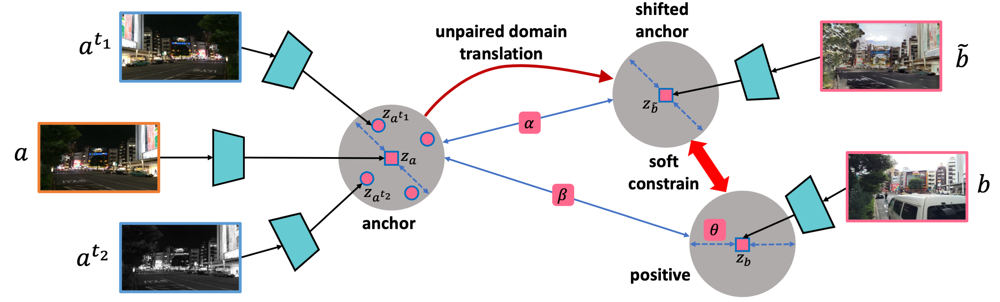
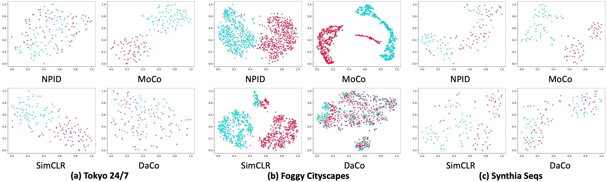

# UMDA

A PyTorch implementation of UMDA based on ACMMM 2021 paper [Unspervised Mutli-Domain Agnostic Feature Learning]().



## Requirements

- [Anaconda](https://www.anaconda.com/download/)
- [PyTorch](https://pytorch.org)

```
conda install pytorch=1.7.0 torchvision torchaudio cudatoolkit=11.0 -c pytorch
```

## Dataset

[Weather Cityscapes](https://team.inria.fr/rits/computer-vision/weather-augment/)
and [Cityscapes Depth](https://www.cityscapes-dataset.com)
datasets are used in this repo, you could download these datasets from official websites, or download them from
[MEGA](https://mega.nz/folder/kx53iYoL#u_Zc6ogPokaTRVM6qYn3ZA). The data should be rearranged, please refer the paper to
acquire the details of `train/val` split. The data directory structure is shown as follows:

 ```
├──rgb
   ├── train
       ├── clear (clear images)
           ├── aachen
               ├── aachen_000000_000019_leftImg8bit.png
               └── ...
           ├── bochum
               ├── bochum_000000_000313_leftImg8bit.png
               └── ...
       ├── fog (fog images)
           same structure as clear
           ...       
       ├── rain (rain images)
           same structure as clear
           ...   
   ├── val
       same structure as train
       ...
├──modal
   same structure as rgb
   ...
```

## Usage

```
python main.py --data_name modal --method_name simclr --gpu_ids 0 1
optional arguments:
--data_root                   Datasets root path [default value is 'data']
--data_name                   Dataset name [default value is 'rgb'](choices=['rgb', 'modal'])
--method_name                 Method name [default value is 'umda'](choices=['umda', 'simclr', 'moco', 'npid'])
--proj_dim                    Projected feature dim for computing loss [default value is 128]
--temperature                 Temperature used in softmax [default value is 0.1]
--batch_size                  Number of images in each mini-batch [default value is 16]
--iters                       Number of bp over the model to train [default value is 40000]
--gpu_ids                     Selected gpus to train [required]  
--ranks                       Selected recall [default value is '1,2,4,8']
--save_root                   Result saved root path [default value is 'result']
--negs                        Negative sample number [default value is 4096]
--momentum                    Momentum used for the update of memory bank or shadow model [default value is 0.5]
```

For example, to train `moco` on `rgb`:

```
python main.py --data_name rgb --method_name moco --batch_size 32 --gpu_ids 1 --momentum 0.999
```

to train `npid` on `modal`:

```
python main.py --data_name modal --method_name npid --batch_size 64 --gpu_ids 2 --momentum 0.5
```

## Benchmarks

The models are trained on one NVIDIA GTX TITAN (12G) GPU. `Adam` is used to optimize the model, `lr` is `1e-3`
and `weight decay` is `1e-6`. `batch size` is `16` for `umda`, `32` for `simclr` and `moco`, `64` for `npid`.
`momentum` is `0.999` for `moco`, `lr` is `1e-3` and `betas` is `(0.5, 0.999)` for Generators, `lr` is `1e-4`
and `betas` is `(0.5, 0.999)` for Discriminators, other hyper-parameters are the default values.

### RGB

<table>
<thead>
  <tr>
    <th rowspan="2">Method</th>
    <th colspan="4">Day --&gt; Night</th>
    <th colspan="4">Night --&gt; Day</th>
    <th colspan="4">Day &lt;--&gt; Night</th>
    <th rowspan="2">Download</th>
  </tr>
  <tr>
    <td align="center">R@1</td>
    <td align="center">R@2</td>
    <td align="center">R@4</td>
    <td align="center">R@8</td>
    <td align="center">R@1</td>
    <td align="center">R@2</td>
    <td align="center">R@4</td>
    <td align="center">R@8</td>
    <td align="center">R@1</td>
    <td align="center">R@2</td>
    <td align="center">R@4</td>
    <td align="center">R@8</td>
  </tr>
</thead>
<tbody>
  <tr>
    <td align="center">NPID</td>
    <td align="center">8.00</td>
    <td align="center">9.33</td>
    <td align="center">10.67</td>
    <td align="center">14.67</td>
    <td align="center">8.00</td>
    <td align="center">9.33</td>
    <td align="center">10.67</td>
    <td align="center">12.00</td>
    <td align="center">3.33</td>
    <td align="center">6.00</td>
    <td align="center">6.67</td>
    <td align="center">8.00</td>
    <td align="center"><a href="https://pan.baidu.com/s/1Y9shBKadeBhkifopHexioA">r2bg</a></td>
  </tr>
  <tr>
    <td align="center">MoCo</td>
    <td align="center">5.33</td>
    <td align="center">5.33</td>
    <td align="center">8.00</td>
    <td align="center">17.33</td>
    <td align="center">6.67</td>
    <td align="center">8.00</td>
    <td align="center">12.00</td>
    <td align="center">21.33</td>
    <td align="center">0.00</td>
    <td align="center">0.00</td>
    <td align="center">0.00</td>
    <td align="center">0.67</td>
    <td align="center"><a href="https://pan.baidu.com/s/1fiTNcm0HV29SExI6ASykPQ">f2jt</a></td>
  </tr>
  <tr>
    <td align="center">SimCLR</td>
    <td align="center">29.33</td>
    <td align="center">33.33</td>
    <td align="center">45.33</td>
    <td align="center">58.67</td>
    <td align="center">32.00</td>
    <td align="center">40.00</td>
    <td align="center">46.67</td>
    <td align="center">57.33</td>
    <td align="center">6.00</td>
    <td align="center">10.00</td>
    <td align="center">14.00</td>
    <td align="center">20.00</td>
    <td align="center"><a href="https://pan.baidu.com/s/1yZhkba1EU79LwqgizDzTUA">agdw</a></td>
  </tr>
  <tr>
    <td align="center">DaCo</td>
    <td align="center"><b>69.33</b></td>
    <td align="center"><b>73.33</b></td>
    <td align="center"><b>81.33</b></td>
    <td align="center"><b>88.00</b></td>
    <td align="center"><b>65.33</b></td>
    <td align="center"><b>80.00</b></td>
    <td align="center"><b>85.33</b></td>
    <td align="center"><b>90.67</b></td>
    <td align="center"><b>52.00</b></td>
    <td align="center"><b>60.67</b></td>
    <td align="center"><b>73.33</b></td>
    <td align="center"><b>81.33</b></td>
    <td align="center"><a href="https://pan.baidu.com/s/139IHtS2_tOZcEK2Qgt-yQw">5dzs</a></td>
  </tr>
</tbody>
</table>

### Modal

<table>
<thead>
  <tr>
    <th rowspan="2">Method</th>
    <th colspan="4">Clear --&gt; Foggy</th>
    <th colspan="4">Foggy --&gt; Clear</th>
    <th colspan="4">Clear &lt;--&gt; Foggy</th>
    <th rowspan="2">Download</th>
  </tr>
  <tr>
    <td align="center">R@1</td>
    <td align="center">R@2</td>
    <td align="center">R@4</td>
    <td align="center">R@8</td>
    <td align="center">R@1</td>
    <td align="center">R@2</td>
    <td align="center">R@4</td>
    <td align="center">R@8</td>
    <td align="center">R@1</td>
    <td align="center">R@2</td>
    <td align="center">R@4</td>
    <td align="center">R@8</td>
  </tr>
</thead>
<tbody>
  <tr>
    <td align="center">NPID</td>
    <td align="center">34.20</td>
    <td align="center">46.00</td>
    <td align="center">55.20</td>
    <td align="center">64.80</td>
    <td align="center">38.40</td>
    <td align="center">46.60</td>
    <td align="center">58.00</td>
    <td align="center">68.80</td>
    <td align="center">4.20</td>
    <td align="center">6.00</td>
    <td align="center">7.90</td>
    <td align="center">11.90</td>
    <td align="center"><a href="https://pan.baidu.com/s/1oUbOqWIJaJbtUDqcqmklgw">bbiv</a></td>
  </tr>
  <tr>
    <td align="center">MoCo</td>
    <td align="center">0.40</td>
    <td align="center">0.80</td>
    <td align="center">1.00</td>
    <td align="center">2.20</td>
    <td align="center">0.40</td>
    <td align="center">0.60</td>
    <td align="center">1.00</td>
    <td align="center">1.80</td>
    <td align="center">0.00</td>
    <td align="center">0.00</td>
    <td align="center">0.10</td>
    <td align="center">0.10</td>
    <td align="center"><a href="https://pan.baidu.com/s/1iR0_2kL9wq44mKM_-sfr_w">ma2a</a></td>
  </tr>
  <tr>
    <td align="center">SimCLR</td>
    <td align="center">43.00</td>
    <td align="center">55.60</td>
    <td align="center">67.20</td>
    <td align="center">76.60</td>
    <td align="center">69.40</td>
    <td align="center">80.40</td>
    <td align="center">89.20</td>
    <td align="center">94.00</td>
    <td align="center">2.30</td>
    <td align="center">3.70</td>
    <td align="center">5.20</td>
    <td align="center">7.80</td>
    <td align="center"><a href="https://pan.baidu.com/s/1ogY5eC1eb3IHemOsVO-ieg">hdhn</a></td>
  </tr>
  <tr>
    <td align="center">DaCo</td>
    <td align="center"><b>96.40</b></td>
    <td align="center"><b>99.00</b></td>
    <td align="center"><b>99.60</b></td>
    <td align="center"><b>99.80</b></td>
    <td align="center"><b>95.60</b></td>
    <td align="center"><b>97.80</b></td>
    <td align="center"><b>99.40</b></td>
    <td align="center"><b>99.80</b></td>
    <td align="center"><b>47.70</b></td>
    <td align="center"><b>65.30</b></td>
    <td align="center"><b>80.10</b></td>
    <td align="center"><b>91.00</b></td>
    <td align="center"><a href="https://pan.baidu.com/s/1ForxWPJ_k3Eq_EXgLtpHCA">azvx</a></td>
  </tr>
</tbody>
</table>

## Results

### RGB


### Modal


### T-SNE


