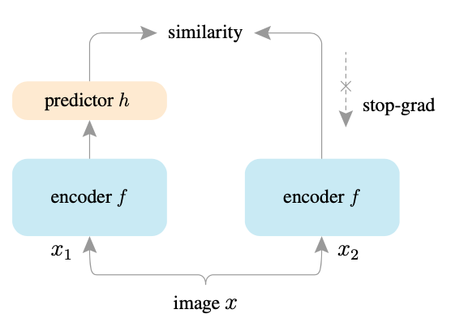

# SimSiam

A PyTorch implementation of SimSiam based on CVPR 2021
paper [Exploring Simple Siamese Representation Learning](https://arxiv.org/abs/2011.10566).



## Requirements

- [Anaconda](https://www.anaconda.com/download/)
- [PyTorch](https://pytorch.org)

```
conda install pytorch=1.7.1 torchvision cudatoolkit=10.2 -c pytorch
```

- thop

```
pip install thop
```

## Dataset

`CIFAR10` dataset is used in this repo, the dataset will be downloaded into `data` directory by `PyTorch` automatically.

## Usage

### Train SimSiam

```
python main.py --batch_size 256 --epochs 1000 
optional arguments:
--feature_dim                 Feature dim for out vector [default value is 2048]
--k                           Top k most similar images used to predict the label [default value is 200]
--batch_size                  Number of images in each mini-batch [default value is 512]
--epochs                      Number of sweeps over the dataset to train [default value is 800]
```

### Linear Evaluation

```
python linear.py --batch_size 512 --epochs 100 
optional arguments:
--model_path                  The pretrained model path [default value is 'results/2048_200_512_800_model.pth']
--batch_size                  Number of images in each mini-batch [default value is 256]
--epochs                      Number of sweeps over the dataset to train [default value is 90]
```

## Results

The model is trained on one NVIDIA GeForce TITAN X(12G) GPU.

<table>
	<tbody>
		<!-- START TABLE -->
		<!-- TABLE HEADER -->
		<th>Evaluation Protocol</th>
		<th>Params (M)</th>
		<th>FLOPs (M)</th>
		<th>Feature Dim</th>
		<th>Batch Size</th>
		<th>Epoch Num</th>
		<th>K</th>
		<th>Top1 Acc %</th>
		<th>Top5 Acc %</th>
		<th>Download</th>
		<!-- TABLE BODY -->
		<tr>
			<td align="center">KNN</td>
			<td align="center">18.52</td>
			<td align="center">564.00</td>
			<td align="center">2048</td>
			<td align="center">512</td>
			<td align="center">800</td>
			<td align="center">200</td>
			<td align="center">88.1</td>
			<td align="center">99.1</td>
			<td align="center"><a href="https://pan.baidu.com/s/1iFdz3RLaatZlEMpSk-Df6g">model</a>&nbsp;|&nbsp;f7yj</td>
		</tr>
		<tr>
			<td align="center">Linear</td>
			<td align="center">11.17</td>
			<td align="center">556.66</td>
			<td align="center">-</td>
			<td align="center">256</td>
			<td align="center">90</td>
			<td align="center">-</td>
			<td align="center"><b>90.1</b></td>
			<td align="center"><b>99.6</b></td>
			<td align="center"><a href="https://pan.baidu.com/s/1euCl86wEz9_Ucs5o8KAY2w">model</a>&nbsp;|&nbsp;v8mf</td>
		</tr>
	</tbody>
</table>

